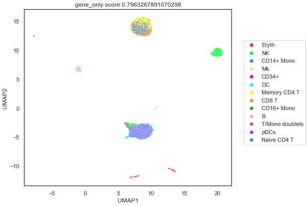

# Creating a Deep Learning Framework for analysis of single cells' transcriptomes.
**Author**: [Darren Teo](https://www.linkedin.com/in/darren-teo-3125871a1/)

**About the Author**: Year 4 student in National University of Singapore (NUS) in Special Programme in Science

**About this Project**: A group project done in the NUS module ZB4171 Advanced Topics in Bioinformatics with two other group mates. Due to the interesting results, this page would only document a known example instead. This project might be extended and made public if our findings are significant enough to be published in a scientific journal.

# Introduction and Significance

Identification of cell types present in a biological sample is a vital part of single-cell sequencing data analysis workflow. In a typical scRNA-seq data analysis, the key computational technique for unbiased cell type identification from sequencing data is unsupervised clustering (Peterson et al., 2017; Stoeckius et al., 2017). Given the high dimensionality of scRNA-seq data (high number of gene features), this is generally performed using a dimension reduction algorithm which is able to capture variability in a limited number of random variables to facilitate the visualization of datasets in 2D or 3D configuration. One commonly used approach is the Uniform Manifold Approximation and Projection (UMAP) which estimates a topology of the high dimensional data and uses this information to construct a low-dimensional representation that preserves relationships. This allows the partitioning of cells into distinct groups based on their transcriptome profiles and thereafter unlocks the possibility of annotating each cluster based on their unique gene signatures for use in a variety of downstream analysis. 

# Methods

## Data and preprocessing

The dataset used in this particular report / project is GSE100866 obtained from Gene Expression Omnibus (GEO) by (Stoeckius et al., 2017). The dataset contains data from CBMC (cord blood mononuclear cells) and 2,000 genes were sequenced. The raw counts were obtained from GEO and the reads were normalized, scaled using `Seurat`.

## Autoencoder foundation

The model I used was 2 hidden layers with each successive layer containing four times less nodes than the previous. The bottleneck layer contains 64 nodes. Because the autoencoder is an unsupervised clustering machine learning task, `train_test_split()` was not needed and the entire dataset was used to train.

## Validation
In order to validate this model, the lower representation of the data extracted from the bottleneck layer was further reduced via UMAP to two dimensions for visualization. The 2D representation weas then fit through a logistic regression model with the cell types taken from metadata as targets. The score of the model was then used as an accuracy metric, as a gauge of how well the clustering was. 

The 2D representation was also plotted as a scatter plot with the cell type identities as different colours.

## Results & Discussion

From the plot, it looks the autoencoder managed to separate clusters, having NK, Erythocytes and B cells as distinct clusters. However, there are still some limitations. Multiple clusters of cells contain more than 1 cell type, such as Memory CD4 T cells, Naive CD4 T cells and CD8 T cells. This might be due to the similar transcriptome of these few cell types and the autoencoder clustered these different cell types together.

As a result, in the future, multiple modalities such as protein expression and ATAC-Seq could be incorporated into the model to better separate these cells with similar transcriptome. However, with current technologies, sequencing multiple modalities and not falling to the curse of dimensionality is simply not possible. Perhaps, as sequencing technologies get more advanced and at a reduced cost, integrating di, tri or even quad modal analysis on single cell profiling is possible.

# Conclusion

This short project shows the usage of [Tensorflow's Autoencoders](https://www.tensorflow.org/tutorials/generative/autoencoder) being applied on scRNA-seq data and is adequate in clustering cells together.